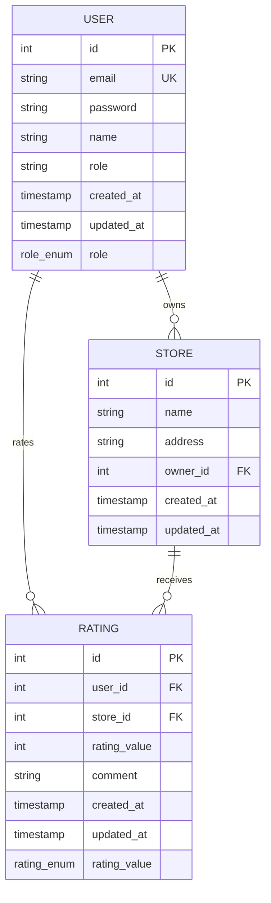

# Entity Relationship Diagram

## ER Diagram (Mermaid.js)

## Entity Descriptions

### USER Entity
- **id**: Primary key, auto-increment
- **email**: Unique email address for login
- **password**: Hashed password (bcrypt)
- **name**: User's full name (20-60 characters)
- **role**: Enum ('SYSTEM_ADMIN', 'NORMAL_USER', 'STORE_OWNER')
- **created_at**: Timestamp when user was created
- **updated_at**: Timestamp when user was last updated

### STORE Entity
- **id**: Primary key, auto-increment
- **name**: Store name (20-60 characters)
- **address**: Store address (≤400 characters)
- **owner_id**: Foreign key to USER.id (the store owner)
- **created_at**: Timestamp when store was created
- **updated_at**: Timestamp when store was last updated

### RATING Entity
- **id**: Primary key, auto-increment
- **user_id**: Foreign key to USER.id (who gave the rating)
- **store_id**: Foreign key to STORE.id (which store was rated)
- **rating_value**: Rating from 1-5
- **comment**: Optional comment (≤500 characters)
- **created_at**: Timestamp when rating was created
- **updated_at**: Timestamp when rating was last updated

## Relationships

1. **User ↔ Store**: One-to-many relationship
   - A user can own multiple stores (if they have STORE_OWNER role)
   - Each store belongs to exactly one owner

2. **User ↔ Rating**: One-to-many relationship
   - A user can rate multiple stores
   - Each rating belongs to exactly one user

3. **Store ↔ Rating**: One-to-many relationship
   - A store can receive multiple ratings
   - Each rating belongs to exactly one store

## Constraints

- **Unique Constraints**:
  - User email must be unique
  - One rating per user per store (composite unique constraint)

- **Foreign Key Constraints**:
  - Store.owner_id references User.id
  - Rating.user_id references User.id
  - Rating.store_id references Store.id

- **Validation Constraints**:
  - Rating values must be 1-5
  - User names: 20-60 characters
  - Store addresses: ≤400 characters
  - Passwords: 8-16 characters with complexity requirements
