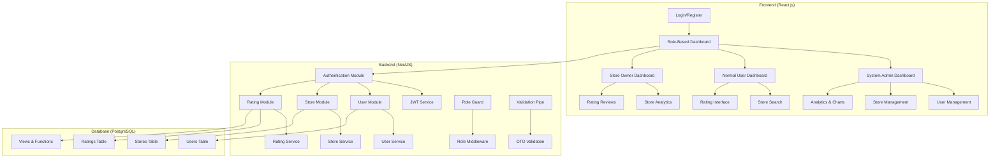

# RateIN System Design

## Architecture Overview

RateIN is a FullStack web application built with a modern, scalable architecture that separates concerns and provides role-based access control.

## Component Diagram



## Authentication Layer

### JWT Implementation
- **Token Structure**: 
  - Header: Algorithm (HS256)
  - Payload: User ID, email, role, expiration
  - Signature: HMAC SHA256

### Role-Based Middleware
```typescript
// Role-based access control
@Roles('SYSTEM_ADMIN')
@UseGuards(RolesGuard)
@Controller('admin')
export class AdminController {
  // Only accessible by System Administrators
}

@Roles('STORE_OWNER')
@UseGuards(RolesGuard)
@Controller('store-owner')
export class StoreOwnerController {
  // Only accessible by Store Owners
}
```

### Authentication Flow
1. **Login Request** → User credentials validation
2. **JWT Generation** → Token with user role and permissions
3. **Token Storage** → Frontend stores JWT in localStorage
4. **Protected Routes** → JWT validation on each request
5. **Role Verification** → Middleware checks user permissions

## Service Layer Architecture

### User Service
- **Authentication**: Login, register, password update
- **User Management**: CRUD operations, role management
- **Validation**: Email format, password complexity, name length

### Store Service
- **Store Operations**: Create, read, update, delete stores
- **Search & Filter**: Name-based search, address filtering
- **Ownership**: Verify store ownership for modifications

### Rating Service
- **Rating Operations**: Create, update, delete ratings
- **Statistics**: Calculate averages, distributions
- **Validation**: One rating per user per store

## Frontend Integration

### Role-Based Routing
```typescript
// Route configuration based on user role
const routes = {
  SYSTEM_ADMIN: [
    '/admin/dashboard',
    '/admin/users',
    '/admin/stores',
    '/admin/analytics'
  ],
  STORE_OWNER: [
    '/store-owner/dashboard',
    '/store-owner/analytics',
    '/store-owner/ratings'
  ],
  NORMAL_USER: [
    '/user/dashboard',
    '/user/stores',
    '/user/ratings'
  ]
};
```

### Component Structure
- **Shared Components**: Header, Footer, Navigation
- **Role-Specific Components**: Dashboard layouts, forms, tables
- **Charts & Analytics**: Recharts.js for data visualization

## Request Flow

### 1. Authentication Flow
```
User Login → Credential Validation → JWT Generation → Token Storage → Protected Route Access
```

### 2. API Request Flow
```
Frontend Request → JWT Validation → Role Check → Service Layer → Database Query → Response
```

### 3. Data Flow
```
Database → Service Layer → Controller → Response DTO → Frontend State → UI Update
```

## Security Features

### Input Validation
- **DTO Validation**: Class-validator decorators
- **SQL Injection Prevention**: Parameterized queries
- **XSS Protection**: Input sanitization

### Authentication Security
- **Password Hashing**: bcrypt with salt rounds
- **JWT Expiration**: Configurable token lifetime
- **Rate Limiting**: API request throttling

## Performance Considerations

### Database Optimization
- **Indexes**: Strategic indexing on frequently queried columns
- **Views**: Pre-computed aggregations for analytics
- **Connection Pooling**: Efficient database connection management

### Caching Strategy
- **Redis Integration**: Session storage and caching
- **Query Caching**: Frequently accessed data caching
- **Frontend Caching**: Local storage for user preferences

## Scalability Features

### Horizontal Scaling
- **Load Balancing**: Multiple backend instances
- **Database Sharding**: Partition data by user/store
- **Microservices**: Separate services for different domains

### Monitoring & Logging
- **Application Metrics**: Performance monitoring
- **Error Tracking**: Comprehensive error logging
- **User Analytics**: Usage pattern analysis

## Development Workflow

### Backend Development
1. **Entity Definition** → Database schema design
2. **Service Implementation** → Business logic development
3. **Controller Creation** → API endpoint definition
4. **Testing** → Unit and integration tests

### Frontend Development
1. **Component Design** → UI/UX implementation
2. **State Management** → Redux/Context API setup
3. **API Integration** → Backend communication
4. **Responsive Design** → Mobile-first approach

## Deployment Strategy

### Environment Configuration
- **Development**: Local PostgreSQL, hot reload
- **Staging**: Cloud database, production-like setup
- **Production**: Managed database, CDN, load balancer

### CI/CD Pipeline
- **Code Quality**: ESLint, Prettier, TypeScript compilation
- **Testing**: Automated test suite execution
- **Deployment**: Automated deployment to staging/production
